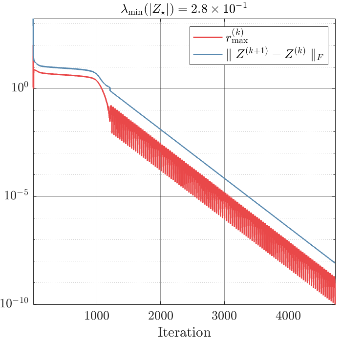

## Codes and Data for the Paper *"Local Linear Convergence of the Alternating Direction Method of Multipliers for Semidefinite Programming under Strict Complementarity"*

### Installation

There is no need to install anything except MATLAB. 

### Usage 

Please directly run `admmdyn.m` in MATLAB to test `BQP/20-1` data with $\sigma = 100$ and random (standard Gaussian) initial guess. In the end, you will get an image like this:

  

To change to different SDP instances, please change the `prefix1` in line 10, `admmdyn.m` to other tags, such as `theta-12`. The program will automatically load `SDP_data.mat` for that tag. The tag names correspond to labels in paper's Table 1. 

Other important hyper-parameters in `admmdyn.m`:

- `input_info.if_save_data`: whether output information from ADMM optimization procedure will be saved or not. Default: `true`. 
- `input_info.if_save_iteration`: whether save each iteration's $Z^{(k)}$ or not. Default: `false`. Warning: if set to `true`, it will consume large amount of disk storage for even for small-scale problems.
- `input_info.sig0`: fixed $\sigma$'s value in ADMM. Default: $100$. 
- `initial_type`: use all-zero or random initial guess for $(X^{(0)}, y^{(0)}, S^{(0)})$. Default: `"rand"`. 
- `ADMM_info.maxiter`: ADMM iteration limit. Default: $10^6$.
- `ADMM_info.tol`: ADMM max KKT residual tolerance. Default: $10^{-10}$.
- `ADMM_info.scaleA`: whether scale `A` in SDP data. Default: `false`.
- `ADMM_info.scaleData`: whether scale `b` and `C` in SDP data. Default: `false`.

